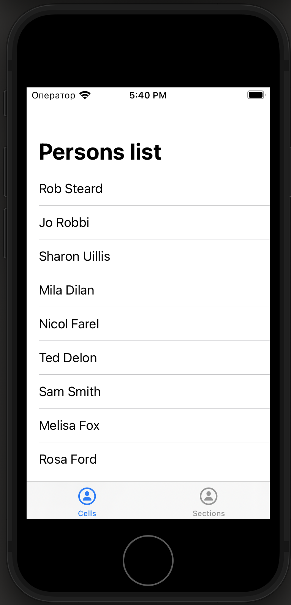
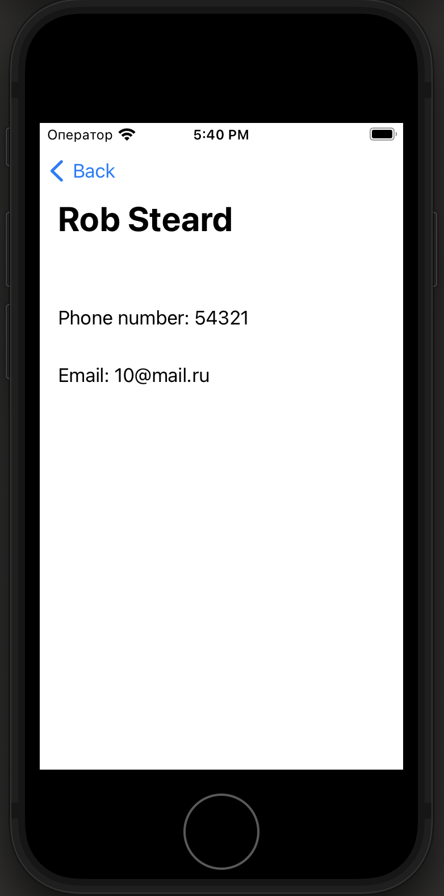
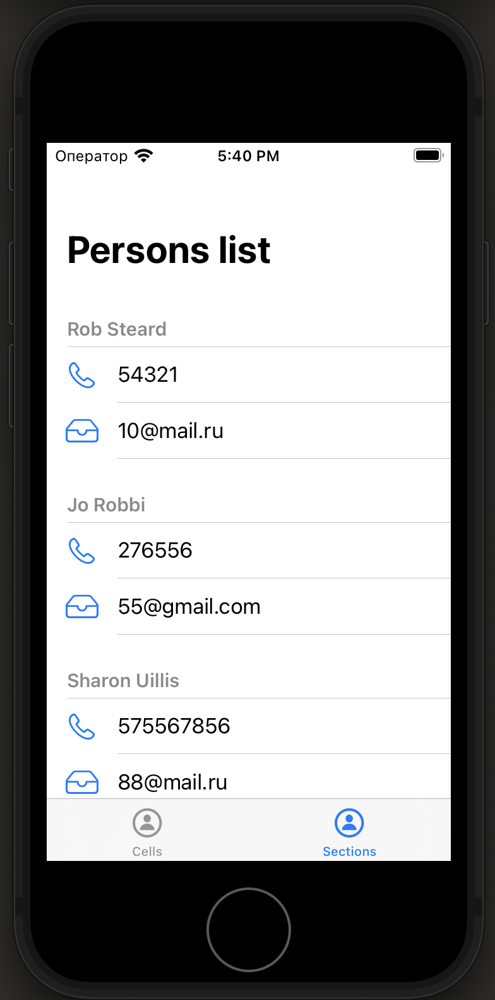

# Persons-List

Persons List - приложение со списком рандомных контактов.

# Интерфейс
1. Экран со списом контактов (вкладка "Cells"). В ячейке указаны имя и фамилия контакта:

2. В результате тапа по ячейке экрана со списком контактов переходим к его детальной информации (телефон, эл. почта):

3. Экран со списом контактов в виде секций (вкладка "Sections"), с указанием контактного телефона и эл. почты:

# Используемый стек технологий
- Язык программирования - `Swift`
- Интерфейс - `UIKit` (исп. TabBarController, TableViewController, NavigationController)
- iOS 14+
